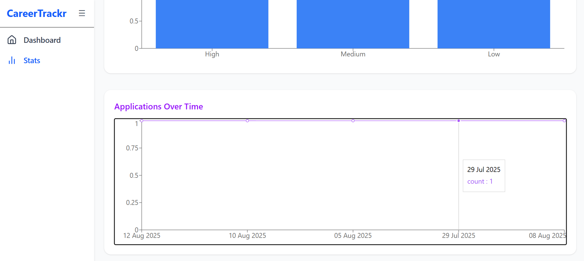

# CareerTrackr - Job Application Tracker

CareerTrackr is a **MERN-based web application** designed to help users **manage, track, and analyze their job applications** in a clean and intuitive interface. It allows users to view all applications, update statuses, and visualize detailed statistics to optimize their job search process.

## Demo

https://career-trackr-shyf.vercel.app/

---

## Features

- **Add, view, and update job applications** with details like company, role, status, location, date, and priority.
- **Filter and search applications** by company, role, or status for easy navigation.
- **Sort applications** by date or priority to focus on important opportunities.
- **Stats Dashboard** with interactive **charts and graphs** to analyze applications, interviews, offers, and more.
- **Responsive design** using Tailwind CSS, optimized for both desktop and mobile.
- **Sidebar navigation** for easy access to Dashboard, Applications, and Stats pages.
- (Future) User authentication for personalized experience.

---

## Tech Stack

- **Frontend:** React.js, Tailwind CSS, Recharts
- **Backend:** Node.js, Express.js, MongoDB
- **Deployment:** Vercel

---

## Getting Started

### Prerequisites

- Node.js (v14 or above recommended)
- npm or yarn package manager
- MongoDB instance (local or cloud)

### Installation

1. Clone the repository:

```bash
git clone https://github.com/your-username/careertrackr.git
cd careertrackr
```

2. Install dependencies for backend:

```bash
cd Back-end
npm install
```

3. Install dependencies for frontend:

```bash
cd ../Front-end
npm install
```

4. Start the backend server:

```bash
cd ../Back-end
node server.js
```

5. Start the frontend server:

```bash
cd ../Front-end
npm start
```

6. Open [http://localhost:5173](http://localhost:5173) in your browser.

---

## Project Structure

```
careertrackr/
├── Back-end/
│   ├── models/              # Mongoose models
│   ├── routes/              # API routes
│   ├── server.js            # Express server
│   └── package.json
├── Front-end/
│   ├── public/
│   │   └── index.html
│   ├── src/
│   │   ├── components/      # Sidebar, ApplicationList, Charts, etc.
│   │   ├── pages/           # AllApplications, StatsPage, Dashboard
│   │   ├── App.jsx          # Main app with routing
│   │   └── index.js         # React entry point
│   ├── package.json
│   └── tailwind.config.js
└── README.md
```

---

## How to Use

- Navigate to the **Dashboard** for an overview of application stats.
- Go to **Applications** to add, view, filter, search, and sort your job applications.
- Visit the **Stats page** to explore interactive charts analyzing your applications by status, priority, and date.
- Update the status of applications (Applied, Interview, Offer, Rejected) in real-time.

---

## Screenshots

_Dashboard_


_Application page_


_Stats: Interactive charts showing application trends_



---

## Future Improvements

- Add **user authentication** with login/signup.
- Integrate **full CRUD operations** for applications with backend API.
- Enable **notifications** for upcoming interviews or deadlines.
- Enhance **UI/UX** with animations and better accessibility.
- Deploy a **live demo** with a connected database for public access.

---

## Contributing

Contributions are welcome! Feel free to open issues or submit pull requests to improve CareerTrackr.

---

## License

This project is licensed under the MIT License.

---

## Contact

Created by Himanshu Tiwari — feel free to reach out!

- GitHub: [https://github.com/Himanshu-xeno](https://github.com/Himanshu-xeno)
- LinkedIn: [https://www.linkedin.com/in/himanshu-sk-tiwari](https://www.linkedin.com/in/himanshu-sk-tiwari)
